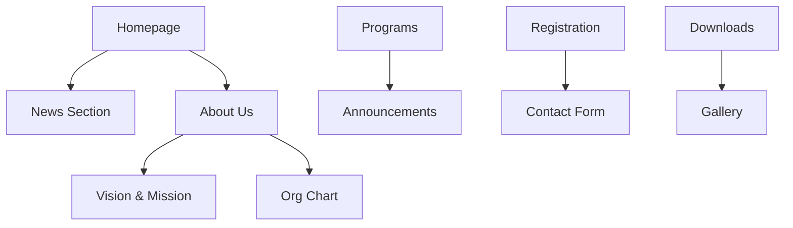
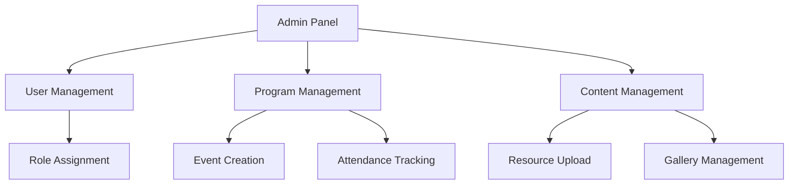
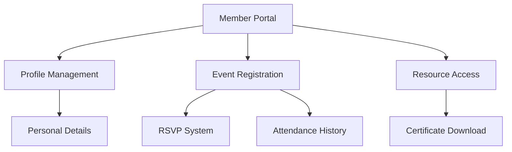
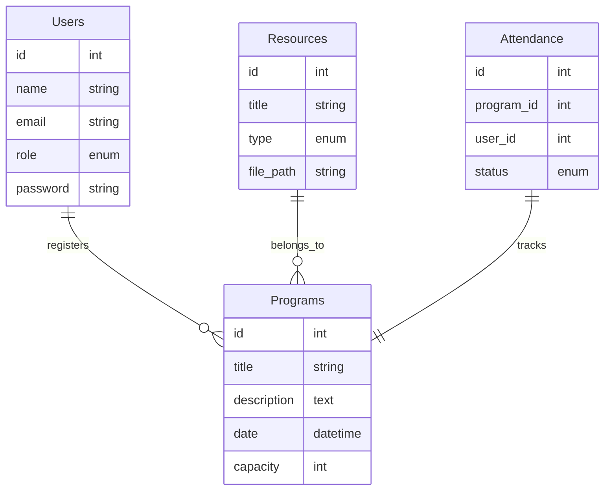

# PeBS Management System

## Overview
A centralized, interactive web platform for PeBS Zon 20 under MBSA that serves as the official information hub, facilitates youth registration, and manages program activities.

## System Architecture

### Public Pages Flow

### Admin Dashboard Flow

### Member Dashboard Flow

## Database Schema

## Technology Stack
- Backend: PHP 8.x with Laravel 10.x
- Database: MySQL 8.0/MariaDB
- Frontend: Blade templating with Tailwind CSS
- Authentication: Laravel Breeze
- Hosting: AWS/DigitalOcean (TBD)

## Implementation Timeline
1. **Project Setup & Core Infrastructure** (1-2 weeks)
2. **Public Pages Development** (2-3 weeks)
3. **Admin Dashboard** (3-4 weeks)
4. **Member Dashboard** (2-3 weeks)
5. **Testing & Security** (1-2 weeks)
6. **Deployment & Documentation** (1 week)

## Documentation
- [Technical Requirements](docs/specifications/technical_requirements.md)
- [Stakeholder Specifications](docs/specifications/stakeholder_specifications.md)
- [Development Setup Guide](docs/guides/development_setup.md)

## Security Features
- Laravel authentication with role-based access control
- CSRF protection
- Form validation
- CAPTCHA integration
- SSL/HTTPS enabled

## Getting Started
1. Clone this repository
2. Install dependencies: `composer install && npm install`
3. Copy .env.example to .env and configure your environment
4. Generate application key: `php artisan key:generate`
5. Run migrations: `php artisan migrate`
6. Serve the application: `php artisan serve`

## Requirements
- PHP >= 8.1
- Composer
- Node.js & NPM
- MySQL/MariaDB

## License
This project is proprietary software developed for PeBS Zon 20 under MBSA.
