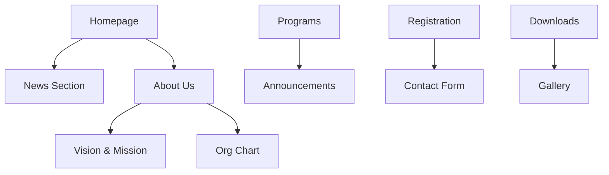
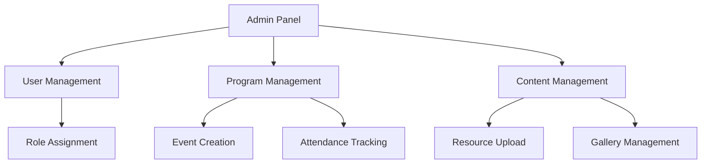
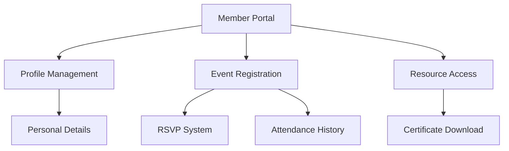
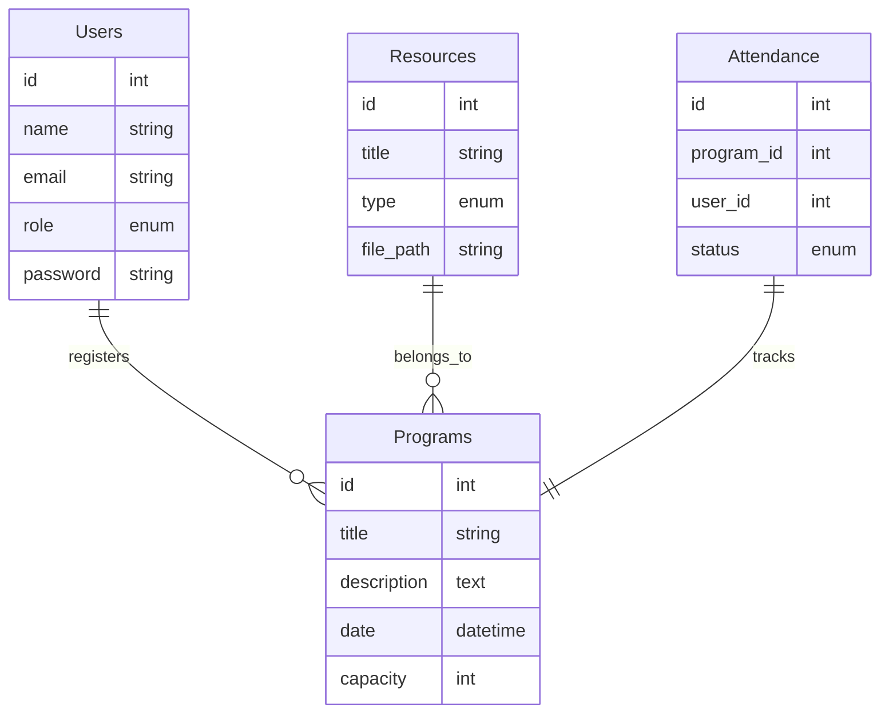

# PeBS Management System Implementation Plan

## Phase 1: Project Setup & Core Infrastructure
**Timeline Estimate**: 1-2 weeks
- Initialize Laravel project with specified dependencies
- Configure MySQL/MariaDB database
- Set up authentication system (Laravel Breeze for simplicity)
- Implement role-based access control (admin, member, viewer)
- Basic frontend scaffolding with Tailwind CSS

## Phase 2: Public Pages Development
**Timeline Estimate**: 2-3 weeks

## Phase 3: Admin Dashboard
**Timeline Estimate**: 3-4 weeks

## Phase 4: Member Dashboard
**Timeline Estimate**: 2-3 weeks

## Phase 5: Testing & Security
**Timeline Estimate**: 1-2 weeks
- Unit testing implementation
- Integration testing
- Security testing (CSRF, XSS, SQL injection)
- Performance optimization
- Mobile responsiveness testing

## Phase 6: Deployment & Documentation
**Timeline Estimate**: 1 week
- Server setup and configuration
- SSL implementation
- Backup system configuration
- Documentation creation
- Admin/user manual preparation

## Database Schema (Initial Design)

## Technology Stack Details
- Laravel 10.x
- PHP 8.x
- MySQL 8.0/MariaDB
- Tailwind CSS
- Laravel Breeze for authentication
- AWS/DigitalOcean for hosting (TBD)

## Required Information Before Development
1. PeBS official logo and brand color codes
2. Language preference (Malay or bilingual Malay/English)
3. Required forms and PDFs for Downloads section
4. Organizational structure and committee information
5. Phase implementation preference (sequential or specific phase priority)
