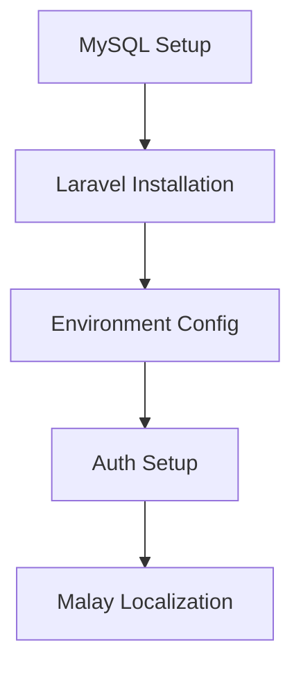
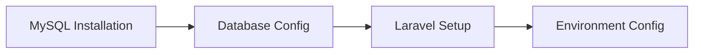
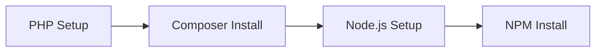

# Active Context: PeBS Management System

## Current Work Focus

### Phase 1: Core Infrastructure Setup
We are currently at the beginning of Phase 1, focusing on setting up the core infrastructure for the project.

### Immediate Tasks

## Recent Decisions & Progress

### Completed Tasks
1. **Documentation & Planning**
   - ✅ Project requirements documented
   - ✅ Technical specifications defined
   - ✅ GitHub repository created
   - ✅ Project structure established

2. **Technical Decisions**
   - ✅ Laravel Breeze chosen for authentication
   - ✅ Blade templating with Tailwind CSS
   - ✅ MySQL as database system
   - ✅ Malay as primary language

### Current Progress
1. **Database Setup** ✅
   - MySQL successfully installed
   - Database 'pebs_management' created
   - User 'pebs_admin' configured with privileges

2. **Development Environment** 🔄
   - PHP environment setup required
   - Composer installation needed
   - Node.js and NPM setup pending

## Next Actions

### 1. MySQL Setup
1. Install MySQL Server
2. Create database user
3. Configure database access
4. Test connection

### 2. Laravel Installation
1. Install Composer
2. Create new Laravel project
3. Install required dependencies
4. Configure environment variables

### 3. Authentication Setup
1. Install Laravel Breeze
2. Customize auth views
3. Implement Malay translations
4. Configure user roles

### 4. Initial Database Structure
1. Create migrations for:
   - Users table
   - Roles table
   - Programs table
   - Resources table
   - Attendance table

## Current Focus Areas

### 1. Technical Setup

### 2. Development Environment

## Pending Decisions

### 1. Database Configuration
- [ ] Database user credentials
- [ ] Backup strategy
- [ ] Migration sequence

### 2. Development Workflow
- [ ] Branch naming convention
- [ ] Commit message format
- [ ] Code review process

## Important Notes

### User Requirements
1. Primary language: Malay
2. Simple, intuitive interface
3. Mobile-responsive design

### Technical Requirements
1. Laravel Breeze for authentication
2. Role-based access control
3. File upload capabilities
4. Secure data handling

## Timeline Status

### Current Phase
- **Phase 1: Core Infrastructure**
- Timeline: 1-2 weeks
- Status: Initial setup stage

### Next Milestone
- Basic authentication system
- Database structure
- Language configuration

## Immediate TODOs
1. [✓] Install MySQL Server
2. [✓] Create database and user
3. [ ] Install PHP >= 8.1 (Next Step)
4. [ ] Install Composer
5. [ ] Create Laravel project
6. [ ] Configure development environment

## Recent Achievements
1. MySQL Server installed and configured
2. Database 'pebs_management' created
3. Database user 'pebs_admin' setup with privileges
4. Access and permissions verified
5. Added detailed PHP installation guide

## Current Focus
1. PHP Installation Requirements:
   - PHP 8.1 or higher
   - Required extensions:
     - curl
     - fileinfo
     - mbstring
     - openssl
     - pdo_mysql
   - Proper php.ini configuration

## Resource Links
- [Laravel Documentation](https://laravel.com/docs)
- [MySQL Documentation](https://dev.mysql.com/doc/)
- [Tailwind CSS Documentation](https://tailwindcss.com/docs)
- [Laravel Breeze Documentation](https://laravel.com/docs/starter-kits#laravel-breeze)
