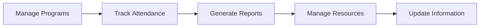

# Product Context: PeBS Management System

## Purpose & Vision

### Why This Project Exists
The PeBS Management System aims to digitalize and streamline the operations of PeBS Zon 20 under MBSA by providing:
1. Centralized information management
2. Automated youth registration
3. Efficient program coordination
4. Digital resource distribution
5. Simplified administrative workflows

### Key Stakeholders
1. **PeBS Zon 20 Committee**
   - Need efficient tools for program management
   - Require easy access to participant data
   - Want streamlined reporting capabilities

2. **Youth Members**
   - Need easy access to program information
   - Want simple registration process
   - Require access to resources and certificates

3. **MBSA Administration**
   - Needs oversight of programs and participation
   - Requires statistical data and reports
   - Wants transparency in operations

## Problems Being Solved

### Current Challenges
1. **Information Distribution**
   - Manual distribution of announcements
   - Inconsistent communication channels
   - Delayed information updates

2. **Registration Management**
   - Paper-based registration forms
   - Manual data entry and processing
   - Difficult to track participation history

3. **Program Administration**
   - Manual attendance tracking
   - Complex certificate generation
   - Difficult resource distribution

4. **Data Management**
   - Scattered participant information
   - Inconsistent record keeping
   - Limited reporting capabilities

### Solution Approach

#### 1. Centralized Information Hub
- Single source of truth for all information
- Real-time updates and announcements
- Organized resource repository

#### 2. Automated Registration System
- Online registration forms
- Automated data processing
- Digital participant records

#### 3. Program Management Tools
- Digital attendance tracking
- Automated certificate generation
- Resource distribution system

#### 4. Administrative Dashboard
- Comprehensive data overview
- Automated report generation
- User role management

## User Experience Goals

### Language & Accessibility
- Primary language: Malay
- Simple, intuitive interface
- Mobile-responsive design
- Clear navigation structure

### User Flows

#### Youth Members

#### Administrators

### Success Criteria
1. **For Youth Members**
   - Easy program discovery
   - Quick registration process
   - Simple resource access
   - Clear attendance history

2. **For Administrators**
   - Efficient program management
   - Simplified data handling
   - Automated reporting
   - Easy content updates

## Implementation Priorities

### Phase 1 Focus
- Basic infrastructure setup
- Essential user flows
- Core database structure
- Malay language implementation

### Key Considerations
1. User-friendly interface
2. Mobile accessibility
3. Data security
4. System reliability
5. Easy maintenance

## Current Status
- Project documentation complete
- Repository structure established
- Ready for technical implementation
- Awaiting database setup
