# Progress Tracking: PeBS Management System

## Overall Progress

```mermaid
graph TD
    subgraph "Phase 1"
        A1[Documentation] -->|Done| A2[Repository Setup]
        A2 -->|In Progress| A3[Database Setup]
        A3 --> A4[Laravel Setup]
        A4 --> A5[Authentication]
    end
    
    subgraph "Phase 2"
        B1[Public Pages] --> B2[Contact Forms]
        B2 --> B3[Registration]
    end
    
    subgraph "Phase 3"
        C1[Admin Dashboard] --> C2[User Management]
        C2 --> C3[Content Management]
    end
    
    subgraph "Phase 4"
        D1[Member Dashboard] --> D2[Profile System]
        D2 --> D3[Program Registration]
    end
```

## Completed Items

### Documentation & Setup (Phase 1 - Part 1)
- ✅ Project requirements analysis
- ✅ Technical specifications document
- ✅ Development setup guide
- ✅ GitHub repository creation
- ✅ Project structure setup
- ✅ Memory Bank establishment

### Technical Decisions
- ✅ Framework selection (Laravel)
- ✅ Database choice (MySQL)
- ✅ Frontend framework (Tailwind CSS)
- ✅ Authentication system (Laravel Breeze)
- ✅ Language preference (Malay)

## In Progress

### Database & Environment Setup (Phase 1 - Part 2)
- ⏳ MySQL installation
- ⏳ Database configuration
- ⏳ User credentials setup
- ⏳ Connection testing

### Development Environment (Phase 1 - Part 3)
- ⏳ PHP environment setup
- ⏳ Composer installation
- ⏳ Laravel project creation
- ⏳ Development tools configuration

## Upcoming Work

### Phase 1 - Core Infrastructure
1. **Database Setup**
   - [ ] Install MySQL
   - [ ] Create database
   - [ ] Configure access
   
2. **Laravel Installation**
   - [ ] Install Composer
   - [ ] Create project
   - [ ] Configure environment
   
3. **Authentication System**
   - [ ] Install Breeze
   - [ ] Configure auth
   - [ ] Setup roles

### Phase 2 - Public Pages
1. **Basic Pages**
   - [ ] Homepage
   - [ ] About Us
   - [ ] Contact

2. **Forms & Interaction**
   - [ ] Contact form
   - [ ] Registration form
   - [ ] File upload system

### Phase 3 - Admin Features
1. **User Management**
   - [ ] User CRUD
   - [ ] Role management
   - [ ] Permissions

2. **Content Management**
   - [ ] Program creation
   - [ ] Resource upload
   - [ ] Gallery management

### Phase 4 - Member Features
1. **User Features**
   - [ ] Profile management
   - [ ] Program registration
   - [ ] Resource access

## Known Issues
1. No current issues - Initial setup phase

## Risks & Mitigations
1. **Database Setup**
   - Risk: New to MySQL setup
   - Mitigation: Following detailed setup guide

2. **Development Environment**
   - Risk: First-time Laravel setup
   - Mitigation: Step-by-step documentation

## Next Immediate Steps
1. Install MySQL Server
2. Create database and user
3. Install Composer
4. Create Laravel project
5. Configure development environment

## Long-term Goals
1. Complete Phase 1 by week 2
2. Public pages live by week 4
3. Admin features by week 7
4. Member features by week 9
5. Testing phase by week 10
6. Deployment by week 11

## Resource Allocation
- Documentation & Planning: Complete
- Environment Setup: In Progress
- Development: Not Started
- Testing: Not Started
- Deployment: Not Started

## Success Metrics
- [ ] All core features implemented
- [ ] Mobile responsiveness achieved
- [ ] Performance targets met
- [ ] Security requirements fulfilled
- [ ] User acceptance testing passed
