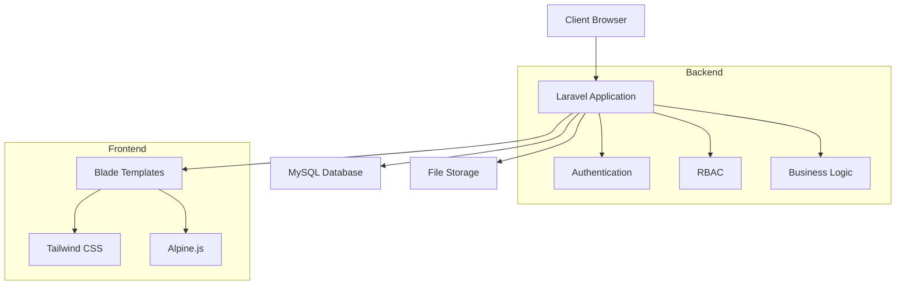
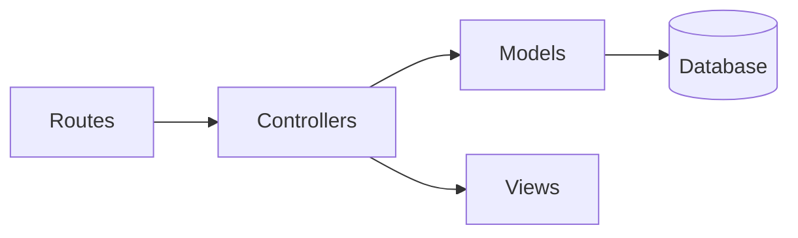
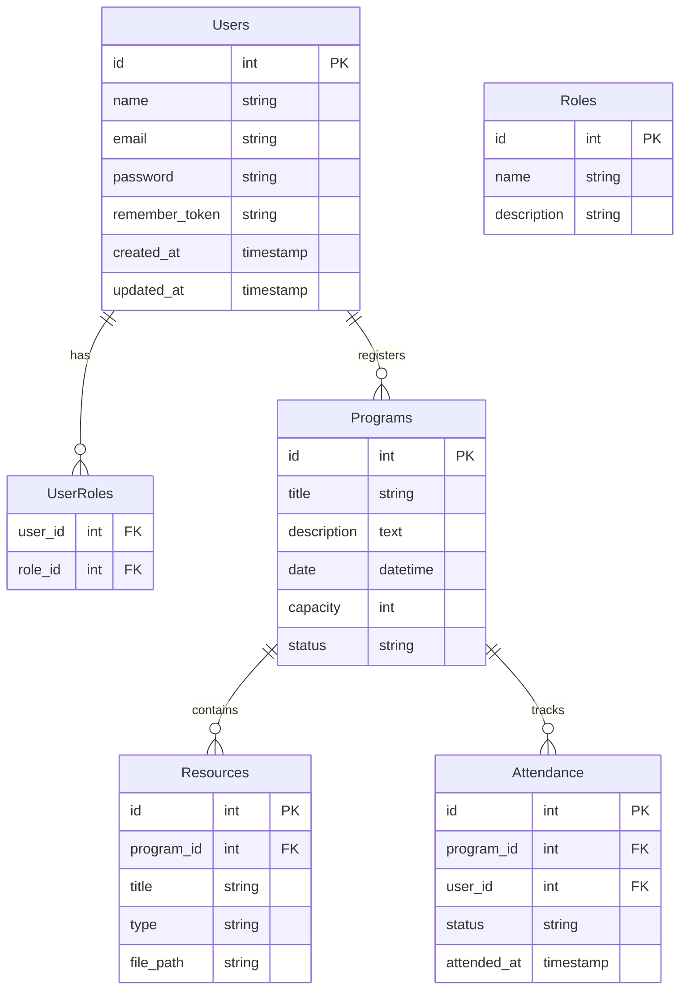
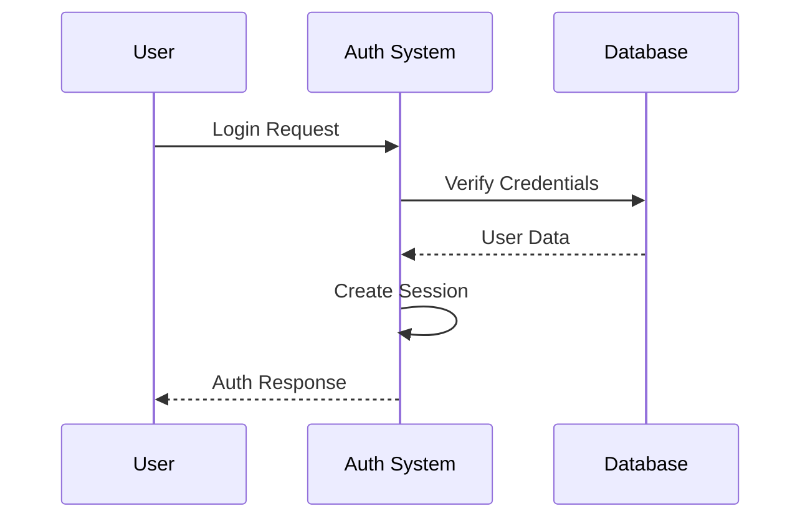
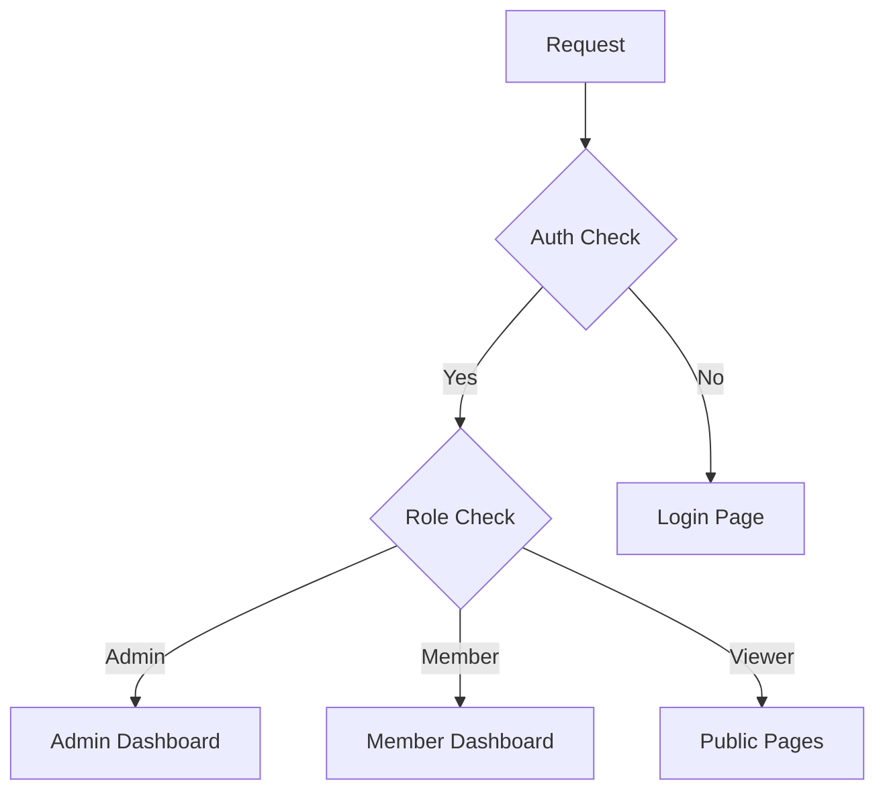

# System Patterns: PeBS Management System

## Architecture Overview

### System Architecture


## Design Patterns

### 1. MVC Architecture


### 2. Repository Pattern
- Separation of database logic
- Clean controller implementation
- Reusable data access layer

### 3. Service Layer Pattern
- Business logic encapsulation
- Reusable service classes
- Clean controller code

### 4. Form Request Pattern
- Validation logic separation
- Clean controller methods
- Reusable validation rules

## Database Design

### Core Tables Structure


## Authentication Flow

### User Authentication


### Role-Based Access


## File Structure

```
src/
├── app/
│   ├── Http/
│   │   ├── Controllers/
│   │   ├── Middleware/
│   │   └── Requests/
│   ├── Models/
│   ├── Services/
│   └── Repositories/
├── resources/
│   ├── views/
│   │   ├── layouts/
│   │   ├── components/
│   │   ├── admin/
│   │   └── member/
│   ├── lang/
│   │   └── ms/
│   └── css/
└── routes/
    ├── web.php
    └── api.php
```

## Key Technical Decisions

### 1. Authentication
- Using Laravel Breeze for:
  - Simple authentication scaffolding
  - Basic UI components
  - Easy customization

### 2. Frontend
- Blade templating:
  - Server-side rendering
  - Simple syntax
  - Easy integration with PHP
- Tailwind CSS:
  - Utility-first approach
  - Easy customization
  - Responsive design

### 3. Database
- MySQL:
  - Robust and reliable
  - Good Laravel integration
  - Easy to manage

### 4. Language Implementation
- Using Laravel's localization:
  - Language files in resources/lang/ms/
  - Easy switching capability
  - Maintainable translations

## Security Patterns

### 1. Input Validation
- Form request validation
- Sanitization middleware
- Type checking

### 2. Output Security
- XSS protection
- CSRF tokens
- Secure headers

### 3. File Handling
- Mime type validation
- Size restrictions
- Secure storage

### 4. Database Security
- Prepared statements
- Migration rollbacks
- Backup strategies

## Performance Patterns

### 1. Caching Strategy
- View caching
- Query caching
- Configuration caching

### 2. Query Optimization
- Eager loading
- Chunked operations
- Indexed queries

### 3. Asset Management
- Asset compilation
- Cache busting
- CDN integration (future)
