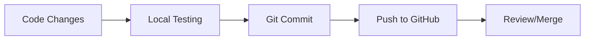
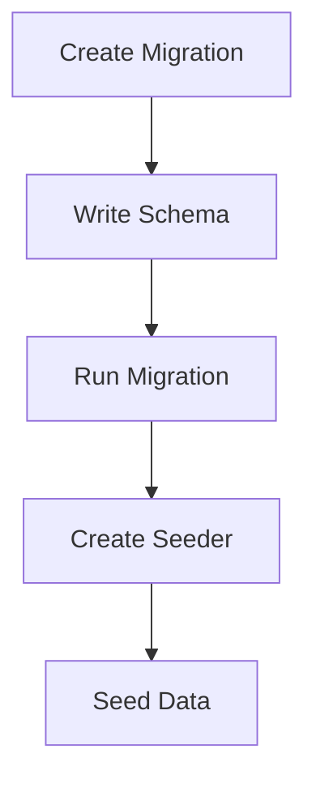

# Technical Context: PeBS Management System

## Development Environment

### Core Technologies
1. **Backend Framework**
   - Laravel 10.x
   - PHP 8.1+
   - Composer package manager

2. **Frontend Technologies**
   - Blade templating engine
   - Tailwind CSS 3.x
   - Alpine.js (optional)
   - Node.js & NPM

3. **Database**
   - MySQL 8.0/MariaDB
   - Migration system
   - Seeders for initial data

4. **Development Tools**
   - VS Code (primary IDE)
   - Git for version control
   - GitHub for repository hosting
   - Laravel Artisan CLI

## Setup Requirements

### System Prerequisites
```bash
# Required Software
- PHP >= 8.1
- Composer
- Node.js & NPM
- MySQL/MariaDB
- Git

# PHP Extensions
- BCMath PHP Extension
- Ctype PHP Extension
- JSON PHP Extension
- Mbstring PHP Extension
- OpenSSL PHP Extension
- PDO PHP Extension
- Tokenizer PHP Extension
- XML PHP Extension
```

### Database Configuration
```env
DB_CONNECTION=mysql
DB_HOST=127.0.0.1
DB_PORT=3306
DB_DATABASE=pebs_management
DB_USERNAME=[username]
DB_PASSWORD=[password]
```

## Development Workflow

### 1. Local Development


### 2. Database Workflow


## Package Dependencies

### PHP Packages
```json
{
    "require": {
        "php": "^8.1",
        "laravel/framework": "^10.0",
        "laravel/breeze": "^1.0",
        "laravel/sanctum": "^3.2"
    },
    "require-dev": {
        "fakerphp/faker": "^1.9.1",
        "laravel/pint": "^1.0",
        "laravel/sail": "^1.18",
        "mockery/mockery": "^1.4.4",
        "phpunit/phpunit": "^10.1"
    }
}
```

### NPM Packages
```json
{
    "dependencies": {
        "tailwindcss": "^3.0",
        "alpinejs": "^3.0",
        "autoprefixer": "^10.4"
    }
}
```

## Development Tools Configuration

### VS Code Extensions
- PHP Intelephense
- Laravel Blade Snippets
- Tailwind CSS IntelliSense
- Git Lens
- DotENV

### Git Configuration
```bash
git config --global user.name "tgazn91"
git config --global user.email "tengkuazn@gmail.com"
```

## Environment Files

### .env Configuration
```env
APP_NAME="PeBS Management System"
APP_ENV=local
APP_KEY=
APP_DEBUG=true
APP_URL=http://localhost

DB_CONNECTION=mysql
DB_HOST=127.0.0.1
DB_PORT=3306
DB_DATABASE=pebs_management
DB_USERNAME=root
DB_PASSWORD=

MAIL_MAILER=smtp
MAIL_HOST=mailpit
MAIL_PORT=1025
MAIL_USERNAME=null
MAIL_PASSWORD=null
MAIL_ENCRYPTION=null
MAIL_FROM_ADDRESS="hello@example.com"
MAIL_FROM_NAME="${APP_NAME}"
```

## Language Configuration

### Localization Structure
```
resources/lang/
└── ms/
    ├── auth.php
    ├── pagination.php
    ├── passwords.php
    └── validation.php
```

## Testing Environment

### PHPUnit Configuration
```xml
<phpunit
    xmlns:xsi="http://www.w3.org/2001/XMLSchema-instance"
    xsi:noNamespaceSchemaLocation="vendor/phpunit/phpunit/phpunit.xsd"
    bootstrap="vendor/autoload.php"
    colors="true"
>
    <testsuites>
        <testsuite name="Unit">
            <directory>tests/Unit</directory>
        </testsuite>
        <testsuite name="Feature">
            <directory>tests/Feature</directory>
        </testsuite>
    </testsuites>
</phpunit>
```

## Current Technical Status

### Completed
✅ Project documentation
✅ Repository initialization
✅ Basic structure setup
✅ Git configuration

### Pending
⏳ Laravel installation
⏳ Database setup
⏳ Package installation
⏳ Environment configuration

### Next Steps
1. Install and configure MySQL
2. Create Laravel project
3. Configure environment
4. Set up authentication
5. Implement localization
